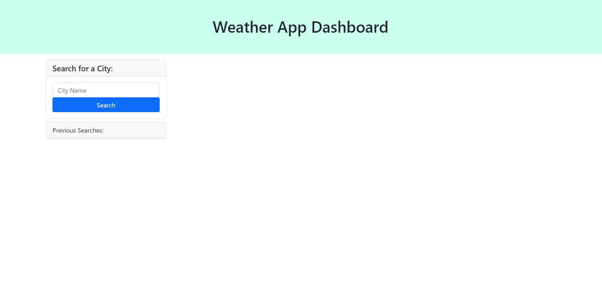

# Weather App

## Description

As a traveler, I wanted an app to see what the weather would be like in various locations. I built this project because it allows me to search any city I choose and get information of current weather conditions as well as a 5 day forecast. Now I will know what I need to pack to be appropriately dressed for the weather on a trip. I learned more about pulling information from APIs and using local storage.

## Installation

No installation required. Link to deployed application provided below:

https://andria-goodwin.github.io/weather-app/

## Usage

Upon first start up, the Weather App features a search bar and an empty list where search history will go.

Once the user has searched a city by typing the city name and clicking the search button, current weather data as well as a 5 day forcase will be shown to the right. The searched city will also be added to the search history list.

If the user has cities in the search history, they can click one of the cities and get weather information that way as well. The search history will stay on the page, even when refreshed, until deleted from local storage.

## Credits

N/A

## License

Please refer to the LICENSE in the repo.
